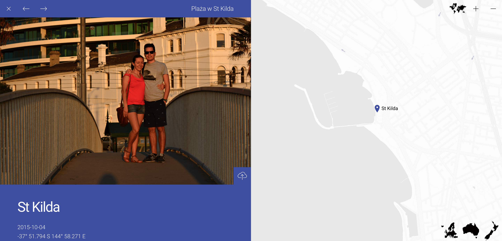
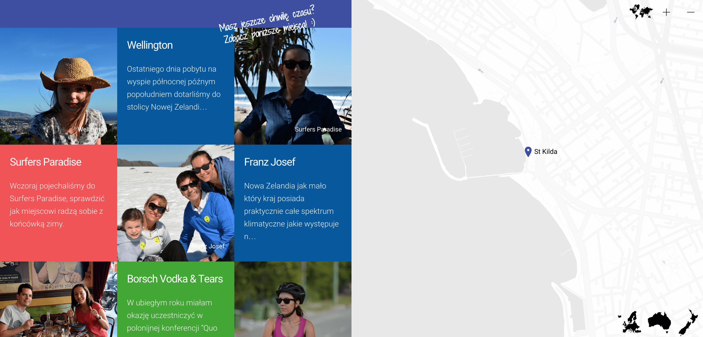
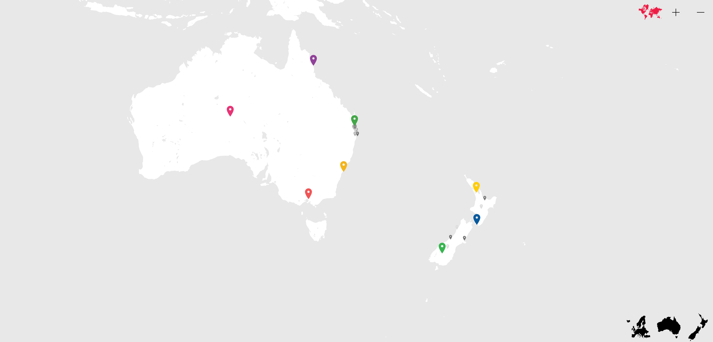

# What is Gladstone?

With a very few steps, Gladstone gives you a phenomenal ability to put some custom markers across the globe
and link them with dedicated stories. Read each of them, enjoy stunning pictures and finally jump from point to point
to experience great adventure with some unique content.





## How Gladstone does it?

By telling this application where is the source of an input JSON (with some essential attributes and proper values), 
you will see stunningly customized Google Map with some clickable elements. Gladstone read coordinates and puts them 
precisely on a proper latitude and longitude.

## What's on my side?

All have to do, is to prepare a JSON. In most cases that will be a valid JSON string, generated by a server side language,
and then (probably) passed from the controller into the view layer. That's it! Follow Installation chapter to read detailed
instructions.

## Requirements

Absolutely minimal. *Modern* internet browser and internet connection (for Google Maps)

## Installation

1. Include the Gladstone style sheets `./css/gladstone.css` into your application.

2. Include Gladstone's library `./javascript/gladstone.js` to be able to create new Gladstone object.

3. Within `body` tag, create new container for the map `<div id="map_canvas"></div>`

4. Finally invoke Gladstone with some mandatory parameters

```js
var gladstone,
    key = '',
    canvas = 'map_canvas'

gladstone = new Gladstone(key, canvas, markers, {
    'lang': 'pl,
    'storyAutoOpen': 1245
});```


**Don't forget to generate your [API key](https://developers.google.com/maps/signup?hl=en)**.

In terms of the `markers` variable, here's how it should look like

```
var markers = [
    {
        'id': 1, 
        'latitude': 39.623791, 
        'longitude': 19.921335, 
        'continent': 
        'europe', 
        'position': '-16° 55.101 S 145° 46.096 E',
        'zoom': 7, 
        'color': 'color_green1', 
        'image': './images/corfu.jpg', 
        'link': 'http://greece.local', 
        'date': '2012-09-27',
        'subTitle': 'Euismod lacus rutrum', 
        'label': 'Corfu', 
        'description': '<p>Lobortis leo est et lorem.</p>'
    }
];```

Repeat this in a loop and your markers are ready to be set on the map.



## Living demo

Check out how Gladstone works [on my own blog](http://komarnicki.pl/mapa).
